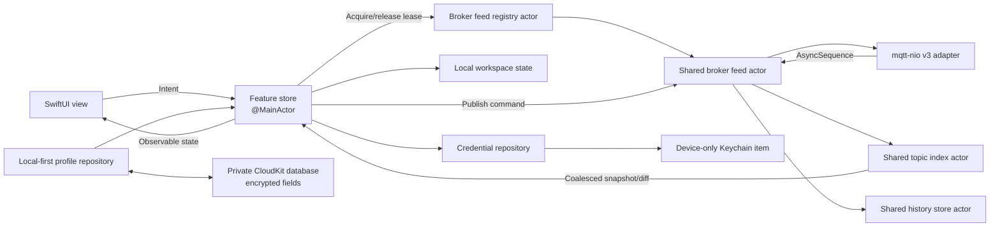
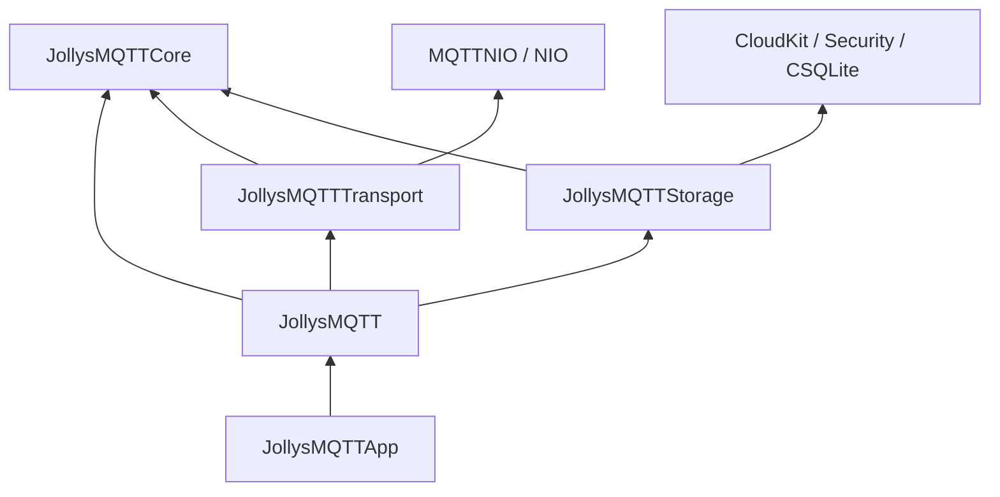

# JollysMQTT Implementation Plan

## 1. Product outcome

Build a native MQTT exploration and debugging client with these defining
behaviors:

1. It runs from one shared SwiftUI codebase on iPhone, iPad, and Mac.
2. A window starts as a broker list. Connecting replaces that window's content
   with a live broker workspace.
3. macOS `Command-N` opens another broker-list window. iPadOS supports the
   equivalent multi-scene workflow. Each window has independent presentation
   state; windows viewing the same effective profile normally share one broker
   feed.
4. Connected workspaces present topics as a live hierarchy, modeled after the
   useful interaction concepts of MQTT Explorer without copying its assets.
5. A selected topic can be inspected as text, formatted JSON, or bytes; copied;
   compared with its previous values; published with QoS and retain options;
   and plotted when it contains numeric data.
6. Reopening the app restores the windows that were open and each window's
   selected broker, topic, outline expansion, inspector state, and graph
   configuration. A restored connection reconnects; it is not expected to have
   remained alive while the app was terminated.
7. Broker definitions synchronize through encrypted fields in the user's
   private CloudKit database. Passwords stay in device-only Keychain items.

Reference behavior:

- MQTT Explorer feature overview:
  <https://mqtt-explorer.com/>
- mqtt-nio:
  <https://github.com/swift-server-community/mqtt-nio>
- Existing local mqtt-nio v3 migration and MQTT Explorer screenshot:
  `~/GitHub/modbus2mqtt`
- Checked-in MQTT Explorer behavioral reference at revision
  `52c576a141d91de47a651f50b118b518f2490bcf`:
  `Documentation/MQTT-Explorer`
- Detailed reference review:
  [MQTT_EXPLORER_FINDINGS.md](MQTT_EXPLORER_FINDINGS.md)
- SwiftUI state restoration:
  <https://developer.apple.com/documentation/swiftui/restoring-your-app-s-state-with-swiftui>
- SwiftUI typed `WindowGroup` restoration:
  <https://developer.apple.com/documentation/swiftui/windowgroup>
- CloudKit encrypted fields:
  <https://developer.apple.com/documentation/cloudkit/encrypting-user-data>
- CloudKit synchronization choices:
  <https://developer.apple.com/documentation/cloudkit/deciding-whether-cloudkit-is-right-for-your-app>
- iCloud key-value storage privacy and quota limits:
  <https://developer.apple.com/documentation/foundation/nsubiquitouskeyvaluestore>

## 2. Explicit assumptions

- Initial deployment targets are iOS/iPadOS 18 and macOS 15, matching
  mqtt-nio 3's declared minimums. Raising these later is easy; lowering them
  would require replacing current observation and window APIs.
- The package and app compile in Swift 6 mode with complete concurrency checks.
- "mqttnio version 3" means the mqtt-nio package's v3 API, not merely MQTT
  protocol 3.1.1.
- The local `modbus2mqtt` checkout has resolved mqtt-nio
  `3.0.0-alpha.2` at revision
  `c980b0f86a3d211f04391a0f5ea627b0960751d3`. Pin that tag exactly until a
  newer version passes JollysMQTT's compatibility suite.
- MQTT 3.1.1 is the initial protocol default. The domain model leaves room for
  MQTT 5 because mqtt-nio supports both.
- iPhone uses one active app scene. Multiwindow is a first-class requirement on
  macOS and iPadOS.
- iOS background execution cannot promise a continuously connected general
  MQTT client. When no iOS/iPadOS scene remains foreground-active, the app
  saves state, closes the feed, suppresses reconnect, and reconnects on
  activation. macOS feeds remain active while leased.
- Broker profiles have a local-first replica and sync through CloudKit when an
  iCloud account is available. Window layout, open windows, topic history, and
  graph samples are device-local.
- Official iOS/iPadOS releases use App Store signing. Official macOS releases
  may use either Mac App Store signing or Developer ID distribution;
  Developer ID provisioning supports CloudKit.
- Publishing the source does not grant a fork access to the official CloudKit
  container. Self-built variants use local-only profiles by default unless the
  builder supplies their own Apple team, bundle ID, container, entitlements,
  and deployed schema.
- Passwords do not sync in v1. When a profile arrives through iCloud on another
  device, the user supplies credentials there once.
- A live feed owns an immutable snapshot of connection-affecting profile
  fields. Editing a connected profile never mutates that feed in place.
- MQTT delivery can outrun local processing. The app prefers an explicit,
  visible overload disconnect to unbounded buffering or silent loss.
- Profile conflict resolution must not use wall-clock timestamps as its
  authority. Device clocks are only presentation metadata; convergence uses
  explicit logical revisions.
- The v1 release does not automatically expire profile tombstones. A fixed
  retention period cannot prove that every offline device has observed a
  deletion and can therefore resurrect deleted profiles.

## 3. Scope

### 3.1 Version 1

- Create, edit, duplicate, delete, and reorder broker profiles.
- TCP and TLS broker connections using mqtt-nio 3.
- Username/password authentication.
- MQTT 3.1.1, clean-session configuration, keepalive, client-ID policy, and
  configurable subscription filters.
- Automatic reconnect with visible state, bounded exponential backoff, jitter,
  and an explicit cancel path.
- Live hierarchical topic outline with topic/current-value search, activity
  indicators, descendant counts, sort modes, and Freeze View.
- Current payload metadata: receive time, QoS, retained flag, byte count, and
  direction.
- Text, formatted JSON, and hex payload presentations.
- Copy topic, raw payload, display text, formatted JSON, and JSON value.
- Paste into a publish composer.
- Publish with QoS 0/1/2 and retain on/off.
- Bounded, deduplicated successful-publish history that can restore a draft.
- Delete a retained value by publishing a zero-byte retained payload after
  confirmation.
- Recursively delete locally known value-bearing topics with exact-count
  confirmation and partial-failure reporting.
- Bounded local per-topic history and current-versus-previous diff.
- Numeric graphs for scalar payloads and selected JSON numeric paths.
- macOS/iPadOS multiwindow and scene restoration.
- iCloud broker-profile synchronization.
- Device-local Keychain credentials.
- Light/dark mode, Dynamic Type, keyboard navigation, VoiceOver labels, and
  reduced-motion support.

### 3.2 Deliberately deferred

- MQTT 5-specific properties and reason-code UI.
- WebSocket transport.
- Client-certificate identity import and management.
- MQTT Last Will configuration.
- Bonjour broker discovery.
- iCloud-synchronized credentials.
- iCloud-synchronized history or graph samples.
- Payload schemas, CBOR/MessagePack/Protobuf plug-ins.
- Broker administration features not defined by MQTT itself, such as ACL,
  retained-message inventories, or connected-client lists.
- Background monitoring and notifications on iOS.
- Export/import of workspace bundles and histories.

The model should not block these features, but none should delay a coherent v1.

## 4. Architecture decision

### 4.1 Pattern

Use feature-scoped MVI for user workflows and actor-owned streaming services for
high-frequency MQTT data.

This is a fit because connection and restoration behavior are explicit state
machines, effects need deterministic cancellation, and user actions must be
testable without a broker. A single global reducer is not appropriate: feeding
every MQTT publication through one app-wide value state would create excessive
copying and invalidation. Instead:

- `ServerListFeature`, `WorkspaceFeature`, `ConnectionFeature`,
  `TopicDetailFeature`, `PublishFeature`, and `GraphFeature` each own small
  state, intents, actions, and effects.
- A registry pools a connection actor, topic index, and history writer by
  profile identity plus effective broker configuration and leases that feed to
  workspaces. It permits only one active configuration generation per profile.
- A broker-feed actor receives the mqtt-nio stream.
- A topic-index actor mutates the high-volume trie and emits coalesced,
  presentation-ready changes.
- A history actor batches durable writes.
- Main-actor observable feature stores consume those bounded/coalesced streams.



### 4.2 Isolation boundaries

- `@MainActor`: observable UI stores, focus/selection state, app commands, and
  scene coordination.
- `BrokerFeedRegistry` actor: reference-counted feeds keyed by an immutable
  effective connection descriptor. It prevents duplicate wildcard
  subscriptions and client-ID collisions when two windows open one profile,
  and prevents two configuration generations of that profile from running at
  once.
- `BrokerFeed` actor: connection lifecycle, subscribe lifetime, publish
  commands, reconnect policy, overload policy, session metrics, and fan-out to
  attached workspaces.
- `TopicIndex` actor: exact MQTT topic trie, latest values, counts, rates, and
  outline snapshots.
- `HistoryRepository` actor: database connection, batching, retention, and
  queries.
- `ProfileRepository` actor: atomic local profile file, CloudKit change
  tracking, logical-revision merge, and tombstones.
- `CredentialRepository` actor: the only owner of Security framework calls. It
  resolves credentials immediately before connecting and never returns them to
  a view or persists them in a feed key.

No `@unchecked Sendable`, `@preconcurrency`, or unsafe isolation escape hatch is
planned. If mqtt-nio forces one, document the safety invariant and isolate it
inside `JollysMQTTTransport`.

### 4.3 State and effect ownership

MVI governs user workflows; it does not turn the high-rate feed into reducer
state. The ownership split is explicit:

| Concern | Canonical owner | UI representation |
|---------|-----------------|-------------------|
| Profile editing and validation | `ProfileRepository` plus pure core validation | `ServerListFeature.State` |
| Profile synchronization capability | injected `ProfileSyncing` adapter | available, local-only, syncing, or failed status |
| Connection/reconnect/session lifetime | shared `BrokerFeed` | immutable `ConnectionSnapshot` observed by each workspace |
| Topic latest values and counts | shared `TopicIndex` | revisioned, coalesced outline snapshots |
| Window selection, expansion, drafts, and graphs | one `WorkspaceFeature` store per scene | canonical feature state |
| Durable messages and retention | shared `HistoryRepository` writer | paged query results, never the whole database in reducer state |
| Keychain material | `CredentialRepository` | only missing/available status |

Reducers remain pure and emit typed effect descriptors. An effect runner in
the composition target resolves repositories and feed leases, maps every
expected result to an action, and owns keyed cancellation. Stream observation
is one cancellable effect per workspace, not one action or task per MQTT
message. Request IDs or revisions reject stale search, history, and snapshot
results.

`ConnectionFeature` is therefore a presentation state machine over a shared
feed snapshot and user commands; it does not independently reconnect the same
broker for each window.

## 5. Repository and target layout

```text
JollysMQTT/
├── AGENTS.md
├── README.md
├── AI/
│   ├── IMPLEMENTATION_PLAN.md
│   ├── MODBUS2MQTT_FINDINGS.md
│   ├── MQTT_EXPLORER_FINDINGS.md
│   └── ADR/
├── JollysMQTT.xcodeproj/
├── JollysMQTTApp/
│   ├── JollysMQTTApp.swift
│   ├── JollysMQTT.entitlements
│   ├── Info.plist
│   └── Assets.xcassets/
└── JollysMQTTPackage/
    ├── Package.swift
    ├── Sources/
    │   ├── CSQLite/
    │   ├── JollysMQTTCore/
    │   ├── JollysMQTTTransport/
    │   ├── JollysMQTTStorage/
    │   └── JollysMQTT/
    └── Tests/
        ├── JollysMQTTCoreTests/
        ├── JollysMQTTTransportTests/
        ├── JollysMQTTStorageTests/
        └── JollysMQTTTests/
```

### `JollysMQTTCore`

- `BrokerProfile`, `SubscriptionDefinition`, `WorkspaceID`
- transport-neutral connection/publish/message values
- `MQTTTransporting` protocol
- exact topic parsing and trie/index
- payload classification and JSON/numeric extraction
- feature states, intents, actions, reducers, and effect descriptors
- reconnect and retention policies

It does not import SwiftUI, AppKit, UIKit, Security, iCloud APIs, MQTTNIO, or
NIO.

### `JollysMQTTTransport`

- mqtt-nio 3 connection adapter
- NIO `ByteBuffer` to `Data` conversion
- TCP/TLS and Network.framework bootstrap selection
- MQTT 3.1.1 configuration mapping
- cancellation and error mapping
- no UI, persistence, or Keychain code

This is the only target that depends on:

```swift
.package(
    url: "https://github.com/swift-server-community/mqtt-nio.git",
    exact: "3.0.0-alpha.2"
)
```

Before feature work, build a narrow compatibility spike that proves on both
macOS and iOS:

1. connect and orderly disconnect,
2. subscribe to `#` and consume its `AsyncSequence`,
3. publish while a subscription is active,
4. cancel subscription and connection tasks,
5. explicitly use `NIOTSEventLoopGroup.singleton.any()` on iOS and macOS,
6. TLS through `TSTLSConfiguration` with system trust, and
7. reconnect a stored `MQTTSession` where appropriate.

The default scoped pattern is already demonstrated by `modbus2mqtt`:

```text
outer reconnect loop
  → MQTTConnection.withConnection
    → connection.subscribe
      → throwing task group
        → subscription consumer
        → publish-command consumer
        → connection/session monitor
```

When the subscription throws, the task group cancels its siblings, unwinding
the subscription and connection scopes before the reconnect loop tries again.
The spike determines whether persistent-session mode should instead use a
longer-lived mqtt-nio `MQTTSession` plus session-level subscription. mqtt-nio
allows only one concurrent connection to borrow a given `MQTTSession`; the
registry must enforce that invariant.

### `JollysMQTTStorage`

- versioned local broker-profile document
- private CloudKit encrypted-record sync and tombstones
- local-only profile-sync adapter for builds without configured CloudKit
- Keychain credential storage
- versioned local workspace records
- local SQLite message-history database
- schema migrations and retention pruning

### `JollysMQTT`

- public `JollysMQTTRootView`
- feature stores and dependency composition
- broker list/editor
- adaptive connected workspace
- topic outline abstraction and platform implementations
- payload/history/diff/publish/graph views
- focused actions and app commands
- package String Catalog and other UI resources

### Thin app target

The app target owns only:

- `@main` and `WindowGroup`,
- iCloud, remote-notification, Keychain, app sandbox, and outgoing-network
  capabilities/entitlements for official cloud-enabled builds,
- app identity, icons, and launch metadata,
- the local Swift package reference.

Build configuration injects profile synchronization capability:

- official App Store and Developer ID builds use the production
  `CloudKitProfileSync` adapter,
- development builds may select the development or production container
  through their provisioning profile,
- self-built/open-source variants default to `LocalOnlyProfileSync`,
- forks that want cloud synchronization provide their own container identifier,
  entitlements, schema, and signing team.

The package must not contain credentials or API tokens. The production
container identifier is not a secret and may appear in the official
entitlements, but third-party build configurations must not select it by
default; Apple signing and provisioning enforce actual container access.

It imports `JollysMQTT` and presents the package root. No broker model, mqtt-nio
call, or history query belongs there.

Target dependencies remain acyclic:



Core declares transport-neutral protocols and values. Transport and storage
implement those protocols without importing each other. The SwiftUI
composition target is the only place that constructs concrete implementations
and injects them into feature effect runners.

## 6. Domain model

### 6.1 Broker profile

`BrokerProfile` is a `Codable`, `Identifiable`, `Hashable`, `Sendable` value:

- immutable `UUID` identity
- display name
- hostname and port
- transport: TCP or TLS
- MQTT protocol version
- optional username; password presence is resolved separately by the
  device-local credential repository
- client ID policy
- clean-session setting
- keepalive interval
- reconnect policy
- one or more subscription filters with requested QoS and enabled state

Synchronization metadata does not pollute the connection value. A separate
`ProfileRecord` envelope contains the profile, created/modified timestamps,
device/revision tie-breaker, reorder rank, and optional deletion tombstone.
Passwords and password-presence flags are not part of either value.

Default subscriptions are `#` and `$SYS/#` at QoS 0. The explicit system
filter is necessary because a root wildcard does not match a first topic level
beginning with `$`. The editor warns that broad filters can be expensive on
large production brokers. Users can disable or replace either filter with
narrower filters before connecting.

### 6.2 Client IDs, feed pooling, and multiple windows

Pool feeds by profile UUID and a `BrokerConnectionKey` derived from normalized
connection-affecting fields plus a non-secret credential revision. Never put a
password in the key. Display-name and ordering edits do not affect the key;
endpoint, authentication, session, TLS, keepalive, reconnect, or subscription
changes do.

- Two windows opening the same effective profile acquire leases on the same
  feed and therefore use one MQTT client ID and one subscription set.
- At most one `BrokerConnectionKey` is active for a profile UUID. Saving a
  connection-affecting edit marks the active feed as using an older snapshot.
  The UI offers **Reconnect All Windows to Apply** or **Apply Later**. A new
  workspace attaches to the active generation with the same banner until the
  old feed ends; it never starts a second generation silently.
- Closing or disconnecting one window releases only its lease. The feed closes
  after the last lease is released, with an injected-clock grace period to
  avoid churn during scene transitions. Explicit disconnect in a workspace
  never disconnects other windows.
- Different profiles remain distinct feeds even if they point at the same host.
- Default client ID: stable installation-and-profile-derived identifier.
- Explicit fixed client ID: warn when another distinct feed already uses it.
- An advanced independent-connection action can be added later using an
  additional instance suffix; it is not the default.
- Clean session on maps to mqtt-nio's identifier-based `withConnection`.
- Clean session off maps to one mqtt-nio `MQTTSession` owned by the feed.
  In-memory reconnect continuity is supported, but persistence of mqtt-nio's
  client-side inflight state across app termination is not currently public.
  Do not promise full QoS 2 session restoration across launches until the
  compatibility spike proves it.

### 6.3 Workspace state

Each scene gets an immutable `WorkspaceID`. Its local record contains:

- mode: broker list or connected profile ID
- reconnect-on-restore preference
- selected topic
- outline expansion paths
- topic search/filter
- active detail section
- publish draft, excluding secret material
- history selection
- graph configurations
- visible time range, auto-scroll, interpolation, and Y-axis mode
- compact destination: topics, details, publish, or charts
- split-view/inspector visibility where portable

Window frame and placement remain system-managed. The data record restores
content; SwiftUI/AppKit restores geometry. Freeze View is intentionally
ephemeral: a restored or reconnected workspace starts live because a frozen
snapshot revision has no meaning in a new process or connection epoch.

### 6.4 Topic identity and tree

MQTT topic parsing must preserve protocol edge cases:

- leading, trailing, and repeated `/` create empty levels and are not collapsed,
- a topic can contain a value and also have children,
- topic names are case-sensitive,
- wildcard characters are valid in filters but not publication topic names.

Use five related identities:

- `BrokerID`: stable profile UUID used by workspace configuration and history.
- `ConnectionDescriptorRevision`: non-secret fingerprint of the immutable
  configuration applied to the active feed.
- `HistorySourceID`: non-secret fingerprint of endpoint, transport, TLS trust
  identity, protocol fields, and authentication principal. It changes when a
  profile may now refer to a different broker or authorization domain, but not
  for password rotation, reconnect, client-ID, or subscription edits. It never
  contains a password or credential bytes.
- `ConnectionEpochID`: changes for every successful MQTT connection, including
  reconnects within the same feed actor.
- `TopicID`: `(BrokerID, exactFullTopic)`, stable across reconnects for history,
  charts, selection, and outline diffing.

Every ingested message receives a monotonically increasing local ordinal within
its connection epoch. `(ConnectionEpochID, ordinal)` is its live identity; the
SQLite row ID is its durable total order, and `HistorySourceID` is stored with
it. History and chart queries default to the profile's current history source
so changing a profile from one broker endpoint to another does not silently
combine telemetry. Wall-clock time alone never resolves equal-timestamp
ordering. Synthetic branch nodes use their exact prefix. Display order uses
localized standard comparison only for presentation; protocol identity is
never localized.

Each node tracks:

- latest message reference
- whether the most recent delivery carried the retained flag
- the connection epoch in which the topic was last observed
- children
- total message count
- descendant value-topic and message counts
- last receive timestamp
- rolling rate/activity bucket
- detected payload presentation

Sibling presentation order is workspace state: alphabetical, newest activity,
descending descendant message count, or descending descendant topic count.
Filtering matches the case-folded exact topic path or latest decoded payload
summary and returns ancestor paths required to locate each match.

On reconnect, previously known nodes become **stale** until observed in the new
connection epoch. History remains queryable, but stale latest values are not
presented as proof of current broker state. Retained deliveries repopulate the
live tree. A newly created index may seed the latest stored values from the
current history source, always marked stale. **Clear Live View** resets the
current topic index without deleting durable history.

## 7. MQTT transport and lifecycle

Connection state is explicit:

```text
idle → resolving → connecting → subscribing → connected
  ↑         ↓           ↓            ↓           ├→ disconnecting → idle
  │         └───────────┴────────────┴───────────┴→ failed
  ├──────────────── waitingToReconnect ←──────────┘
  ├──────────────── suspended (no active scene) ──→ resolving
  └──────────────── overloaded ── user Retry ─────→ resolving
```

User disconnect and window close detach that workspace and suppress reconnect
for that lease. The shared feed goes to `idle` only after its last lease is
released. `failed` carries a typed reason and may schedule reconnect;
`overloaded` never auto-reconnects; `suspended` is expected lifecycle state,
not an error.

Implementation requirements:

- Use mqtt-nio v3's structured connection/subscription scopes.
- Mirror the proven `modbus2mqtt` supervision rule: one thrown MQTT worker error
  cancels sibling workers, unwinds the scoped connection, and only then allows
  the outer reconnect loop to continue.
- One parent feed task owns all child subscription, command,
  connection-monitor, and event-processing work.
- Explicitly close the active `MQTTConnection` when feed cancellation occurs;
  do not assume an arbitrary wait on the NIO close future is
  cancellation-aware.
- Cancellation propagates from the last feed lease to subscriptions, batching,
  and connection cleanup.
- Convert `ByteBuffer` to owned `Data` at the transport boundary before values
  enter core, history, or UI modules.
- Pass a per-feed `swift-log` logger to mqtt-nio with broker/profile metadata,
  while redacting credentials and payloads.
- Expected errors become typed actions such as authentication rejected, TLS
  trust failed, network unavailable, broker unavailable, protocol error, and
  subscription rejected.
- Reconnect uses exponential backoff with jitter and a maximum delay only for
  retryable failures such as transient DNS, network-path, transport, and broker
  availability errors. Authentication rejection, TLS trust failure, invalid
  configuration, permanent subscription rejection, local overload, and an
  explicit disconnect require user action. Network path recovery can trigger
  an earlier retry for a retryable failure.
- The UI always shows state, last failure, next retry time, and a Retry/Cancel
  action.
- Receive timestamps are local arrival times; MQTT 3.1.1 does not provide a
  broker event timestamp.
- Apply a configurable maximum payload size before copying into history/UI.
- Never decode arbitrary bytes as UTF-8 without validation.
- Treat mqtt-nio's `MQTTSubscription` as an unbounded upstream sequence in the
  pinned alpha.2 implementation. Its consumer must do only bounded validation,
  assign sequence metadata, copy the allowed payload, and offer the message to
  a fixed-capacity ingress queue. It must not await database I/O, JSON parsing,
  or the main actor.
- A full ingress queue is a modeled `.localOverload` connection failure. Close
  the connection, reject and count the publication that could not be enqueued,
  stop accepting new publications, drain already accepted messages within a
  bounded shutdown deadline, and require a controlled reconnect. If the drain
  deadline expires, persist a history-coverage gap before discarding the
  remainder. Do not spawn one task per message or pretend the rejected
  publication was accepted.
- Publish commands use a separate bounded queue so a receive flood cannot
  starve user actions. Queue-full is a synchronous, user-visible publish
  rejection before mqtt-nio is called.

The mqtt-nio default connection event loop is POSIX. JollysMQTT must pass
`NIOTSEventLoopGroup.singleton.any()` explicitly on Apple platforms; iOS should
always use Network.framework. TLS defaults to
`TSTLSConfiguration(certificateVerification: .fullVerification)` with system
trust. Custom CA and client identity support is deferred until the basic Apple
transport path is proven on device.

### 7.1 Scene and process activity policy

- macOS feeds stay active while they have at least one lease.
- On iOS and iPadOS, each lease reports foreground-active or dormant state.
  A feed remains active while any attached scene is foreground-active.
- When the last active scene becomes dormant, persist workspace state, finish
  a bounded best-effort flush, close the connection, and suppress reconnect.
  Reactivation acquires or resumes the feed and reconnects. The app must remain
  crash-safe if iOS suspends or terminates it before the flush completes.
- Protected-data unavailability and app termination use the same ordered
  shutdown path. The app never promises background MQTT delivery.
- Grace periods, reconnect delays, and activity transitions use injected
  clocks so tests do not sleep.

A workspace owns its lease through one structured observation task. Task
cancellation runs an idempotent asynchronous release; view `onDisappear` and
`deinit` are not the primary correctness mechanism. A deinitializer may only
provide a best-effort leak safeguard.

## 8. Streaming and performance design

A broker can produce messages much faster than a SwiftUI outline should redraw.
The transport path and presentation path therefore have different guarantees:

- The broker-feed actor processes every message accepted under configured
  limits.
- History persistence is bounded and batched.
- The topic index always keeps the latest value and correct counters.
- UI activity updates are coalesced, initially to at most 10 updates per second.
- Multiple messages for the same topic in one UI interval collapse into one
  latest-node update, without losing durable history entries while storage is
  healthy and within configured limits.
- Outline filtering and sorting are prepared outside `body`.
- Rows receive narrow immutable snapshots with stable IDs.
- Freeze View holds a workspace's displayed snapshot while the feed, counters,
  bounded history, and persistence continue. It exposes a bounded pending
  change count. Jump to Live replaces the frozen snapshot with the newest
  coalesced snapshot instead of animating every intermediate mutation.

The bounded pipeline is:

```text
mqtt-nio subscription (upstream currently unbounded)
  → fast transport consumer
  → fixed-capacity ingress queue
  → feed ingestion actor
      ├── topic-index update
      ├── fixed-size history batch
      └── revisioned presentation coalescer
```

Queue capacities are configuration values with conservative defaults and
observable high-water marks. The contract for a full ingress queue is
deterministic: reject the publication that cannot be enqueued, increment the
overload counter, close the connection, drain already accepted messages to the
index/history within a bounded deadline, record a coverage gap for anything
discarded after that deadline, surface `.localOverload`, and pause automatic
reconnect until the user chooses Retry. This bounds JollysMQTT-owned queues,
but it does not by itself bound mqtt-nio's internal subscription buffer.
Milestone 0 must measure total-process memory under a sustained producer. If
the dependency buffer can exceed the memory budget before overload teardown,
feature work is blocked on an upstream fix, a narrowly maintained patch, or a
newer verified mqtt-nio release.

History has a different failure scope from live ingestion. If its bounded
handoff or database fails, the feed enters a visible `.historyDegraded` state,
stops claiming durable coverage, and counts messages not persisted while the
live index continues. The user can retry history or disconnect. Revisioned
presentation snapshots remain newest-wins; durable-message loss is never
silent or represented as a complete interval.

Feed fan-out is latest-state, not lossless event replay. Each workspace gets a
single-slot newest-wins snapshot channel plus monotonically increasing
revisions. A revision gap tells the store to replace its outline snapshot;
slow or frozen windows cannot retain an unbounded backlog. Connection-state and
publish-result actions remain lossless on their separate bounded control
channel.

Payload work is tiered:

1. ingress validates size and owns raw `Data`,
2. indexing derives only a capped UTF-8/search summary and cheap scalar hint,
3. full JSON parsing and structural views are lazy for selected content,
4. configured graph paths run targeted numeric extraction during ingestion.

Do not parse and retain a full JSON tree for every latest topic value.

Initial performance targets:

- 10,000 discovered topics and a 100,000-message-per-minute stream of
  deterministic 256-byte payloads for 10 minutes.
- After the producer stops, ingress and history queues return to their baseline
  depth and memory reaches a stable plateau rather than growing with message
  count.
- Coalesced main-actor updates stay at or below 10 per second; snapshot
  generation and UI application are measured separately.
- Search, selection, Freeze View, and scrolling remain interactive on one
  documented baseline Mac and one baseline iOS device.
- No app-owned unbounded stream, array, task set, or payload cache beyond the
  documented mqtt-nio upstream edge.
- Releasing the last workspace lease releases the feed and large topic tree.

Milestone 0 records baseline throughput and memory numbers. Milestone 2 turns
them into regression thresholds with an allowed percentage delta, rather than
inventing hardware-independent absolute timing limits.

If a pure SwiftUI `OutlineGroup` cannot meet the macOS target, use an
`NSOutlineView` representable with incremental row reloads and preserved
expansion. iOS/iPadOS use an adaptive SwiftUI list/navigation presentation.

## 9. User interface

### 9.1 Broker-list workspace

New windows show:

- searchable list of saved brokers
- broker name with a secondary endpoint summary
- connection status only for this window's attempted connection
- Add, Edit, Duplicate, Delete, and Connect actions
- validation in the editor before Save/Connect
- advanced disclosure for client ID, clean session, keepalive, subscriptions,
  reconnect, and TLS settings
- a visible indicator when a synced profile lacks a local password

On macOS:

- `Command-N`: new window at broker list
- `Command-O` or Return: connect selected broker in current window
- `Command-Shift-N`: add broker
- `Command-W`: close current window and release its feed lease

On iPhone, the profile editor uses `NavigationStack` and the connected
workspace uses the compact destinations defined below. On iPad and Mac, use
`NavigationSplitView` where it maps cleanly to the content.

### 9.2 Connected workspace

Wide layout:

```text
┌──────────────────────┬───────────────────────────────────────────┐
│ Topic outline        │ Selected topic                            │
│ search + activity    │ metadata / value / history / publish      │
│ branch counts/value  │ optional inspector                        │
├──────────────────────┴───────────────────────────────────────────┤
│ Pinned graph dashboard: resizable cards in an adaptive grid      │
└──────────────────────────────────────────────────────────────────┘
```

Compact layout gives each major workflow a full-width destination. No feature
should require a pointer, hover, or secondary click.

On iPhone, expose four native compact destinations in a `TabView` or equivalent
accessible navigation model:

1. Topics
2. Details
3. Publish
4. Charts

Keep each destination's state alive while switching. Selecting a value-bearing
topic can advance to Details, and returning to Topics scrolls to the selected
row. iPad uses `NavigationSplitView` where space allows while retaining
first-class access to Publish and Charts.

Topic outline row:

- segment name
- descendant topic and message counts on branch rows
- retained indicator
- recent-activity pulse that respects Reduce Motion
- optional compact current scalar or JSON summary after `=`
- child disclosure
- stable selection and expansion during updates

Outline controls include:

- search over full topic paths and latest decoded payload summaries
- sort by name, recent activity, descendant messages, or descendant topics
- Freeze View / Jump to Live with pending-change count
- keyboard traversal matching native outline conventions

Context actions:

- copy full topic
- open publisher for this topic
- plot numeric value
- delete retained value
- clear local history

### 9.3 Payload inspector

Automatic presentation order:

1. valid JSON → formatted structural view and raw view,
2. valid UTF-8 → text,
3. otherwise → hex with byte count.

The JSON view:

- preserves numeric precision as far as Foundation parsing permits,
- supports expanding/collapsing containers,
- lets a numeric leaf create a graph using a JSON Pointer-like path,
- copies either the selected scalar, formatted subtree, or entire document.

The metadata header shows exact topic, local receive time, QoS, retained flag,
direction, and payload size.

The retained flag is labeled as metadata on the received publish. Help text
must not imply that a live publish with `retain == false` proves the broker has
no retained value; brokers set the flag according to retained-delivery
semantics. The UI says **Retained delivery** rather than **Has retained value**.

### 9.4 Publish composer

Fields:

- topic
- payload editor
- text/JSON/hex input mode
- JSON validation/format action
- QoS 0/1/2
- retain toggle
- Publish button and `Command-Return` on macOS

Selecting a topic pre-fills the composer unless the user has manually edited
the draft topic. Standard Copy, Paste, Paste and Match Style, Select All, and
Undo operate on the focused topic or payload editor. A bounded, deduplicated
history of successful publishes can repopulate topic, payload, mode, QoS, and
retain settings. Failed publishes never enter that history.

Publishing a zero-byte retained payload is labeled "Delete retained value" and
requires confirmation. A normal zero-byte non-retained publish remains
available.

Recursive retained deletion is a separate destructive action. It enumerates
only unique, non-stale, locally known value-bearing topics from the current
history source in the selected subtree, confirms the exact count, publishes
zero-byte retained values, advances local state only after each successful
publish, and reports partial failures with retryable topics. It is labeled as
an attempt to clear broker-retained state, not as a complete retained-message
inventory operation.

### 9.5 History and diff

- Keep newest-first bounded history per topic.
- Allow keyboard and pointer selection.
- With no explicit baseline, compare current with the immediately previous
  entry. Selecting a history row compares current with that entry; selecting it
  again clears the override.
- Show receive time, elapsed time from the newer message, and compact
  QoS/retain/direction metadata, with a row-level copy action.
- JSON values receive structural diff; text receives line diff; bytes receive a
  hex-level summary rather than pretending to be text.
- A successful outgoing publish appears in local history with a generated
  operation ID and direction metadata. An incoming broker echo is a separate
  message because MQTT 3.1.1 has no reliable correlation identifier. The UI
  may visually suggest a time/payload match, but storage never deletes or
  merges either record using that heuristic.

For QoS 0, “successful” means mqtt-nio accepted/wrote the publish without a
reported transport error. For QoS 1 and 2, it means the corresponding protocol
acknowledgement flow completed. It never means an application consuming the
topic processed the value.

Default retention proposed for the first implementation:

- up to 1,000 entries per topic,
- up to 250 MB per broker database,
- payloads over 1 MB represented by metadata unless the user opts into a
  higher limit.

These values must be configurable and enforced in the storage actor.

### 9.6 Graphs

Use Swift Charts.

A graph series is:

- broker/profile ID
- exact topic
- scalar root or JSON numeric path
- display name and style
- conversion rule: number, boolean-as-0/1, or optional unit scaling

Graph state includes time range, auto-scroll, line/point mode, Y-axis
automatic/fixed bounds, downsampling policy, color, adaptive grid span, card
order, paused state, and sample-clear marker. Persist the configuration in the
workspace record. Rebuild samples from local history on restoration, then
append live points.

The concrete MQTT Explorer screenshot in
`~/GitHub/modbus2mqtt/Images/mqtt-explorer.png` shows a useful dashboard
interaction to preserve:

- clicking a numeric value pins a graph without replacing the topic outline,
- multiple graphs appear simultaneously in a card grid,
- each card has Pause/Resume, Settings, and Remove controls,
- settings include Y-axis range, time range, line/point/step presentation,
  color, adaptive size, clear displayed samples, and reorder,
- graph order, size, paused state, and settings restore with the workspace.

Clearing graph samples does not clear durable topic history. Pausing one card
freezes that card's display while broker ingestion and other graphs continue.

On compact devices, show the pinned graphs as a list or one focused chart
instead of forcing a desktop grid.

Use a bounded downsampling algorithm for display; never pass every historical
sample to Charts when the pixel width cannot show it. A graph is an inspection
tool, not an authoritative telemetry database.

## 10. Windowing and restoration

Declare `WindowGroup(for: WorkspaceID.self)` with a default-value closure.
`WorkspaceID` is lightweight, `Hashable`, and `Codable`; SwiftUI persists its
binding for state restoration. Every New Window action generates a fresh ID,
because `openWindow(value:)` brings an already presented equal value forward
instead of creating a duplicate.

Expected scene flow:

1. `Command-N` calls `openWindow(value: WorkspaceID())`.
2. The default workspace record is `.serverList`.
3. Connect updates the record to `.connected(profileID)` and renders the
   connected workspace in the same scene.
4. Each window creates its own feature store and acquires a lease from the
   broker-feed registry. The same effective profile reuses an existing feed.
5. Scene state changes are debounced, but important transitions
   (connect/disconnect, publish-draft edit completion, graph configuration)
   also have explicit flush points. Writes are atomic.
6. Closing the scene cancels its structured workspace task, releases its feed
   lease idempotently, and retains the closed workspace record for seven days
   for crash/reopen recovery before startup pruning. The last feed lease
   triggers connection cancellation and cleanup.
7. At app relaunch, SwiftUI restores open `WorkspaceID` values; the package
   loads each corresponding state and reconnects when configured.

Use `@SceneStorage` only for small plist-compatible routing values. Store the
versioned workspace payload in local application support keyed by
`WorkspaceID`; scene storage is not the application's data model and provides
no persistence timing guarantee.

Set `UIApplicationSupportsMultipleScenes` to `true` for iPadOS. Handle a nil or
undecodable restored presentation value by creating a new server-list
workspace, never by crashing or guessing a broker profile.

Restoration tests must cover normal quit/relaunch. Force-quitting from the app
switcher can intentionally discard system-preserved scene state during
development and is not the only valid test procedure.

## 11. Storage and iCloud

### 11.1 Broker profiles

Use a local-first replica with encrypted CloudKit synchronization:

- an atomic, versioned local JSON document is the immediate read/write source,
- one `CKRecord` per profile in a custom zone in the user's private database,
- endpoint, username, subscription, and other profile payload fields use
  `CKRecord.encryptedValues`,
- the record name is the profile UUID; it contains no broker address,
- `CKSyncEngine` drives scheduled send/fetch work and persists its state,
- represent the profile payload as one last-writer-wins register ordered by a
  logical revision `(counter, installationID)`. A local mutation advances past
  the greatest observed counter; `installationID` resolves concurrent equal
  counters deterministically. Wall-clock modification dates are informational
  only,
- represent reorder rank as a separate versioned register so reordering does
  not overwrite a concurrent profile-content edit,
- make deletion a tombstone revision that wins over every older live revision.
  Recreating a deleted profile uses a new UUID,
- retain tombstones indefinitely in v1. Compaction may be added only after a
  design can prove every potentially returning replica has observed the
  deletion; elapsed wall-clock time alone is insufficient,
- validate all merged data and retain a last-known-good local backup,
- iCloud unavailable, signed out, rate-limited, or offline is a sync status,
  not a reason to make local profiles unusable.

`ProfileRepository` depends on a `ProfileSyncing` protocol. The
`CloudKitProfileSync` implementation is selected only when the signed app has a
configured container; `LocalOnlyProfileSync` performs no remote operations and
reports `.localOnly`. Missing entitlements or container configuration must
degrade to a clear local-only state rather than making profile management fail.

Do not use `NSUbiquitousKeyValueStore` for these records. Apple documents that
its on-disk representation is unencrypted and says not to store sensitive
information there; this project treats broker endpoints and usernames as
private. CloudKit encrypted fields preserve the required cross-device behavior
without contradicting that privacy rule.

The sync adapter is behind a repository protocol and all revision/merge logic
is pure and testable without CloudKit. Treat CloudKit change tags as transport
conflict detection, not as the domain's merge order. Before release, create the
development schema, exercise account-change and encrypted-data-reset recovery,
and promote the schema to production. `CKSyncEngine` also requires the
CloudKit and remote-notification capabilities; official build configurations
must declare both, while local-only builds declare neither.

### 11.2 Credentials

- Generic-password Keychain item keyed by broker UUID and credential kind.
- Explicitly set `kSecAttrSynchronizable` to false and use a `ThisDeviceOnly`
  accessibility class; prefer `kSecAttrAccessibleWhenUnlockedThisDeviceOnly`
  unless a tested reconnect requirement proves first-unlock access necessary.
- Never serialize the password into the profile.
- Deleting a profile offers to delete its local credential.
- Synced profiles can exist without credentials.
- Certificate file bookmarks, if later added, remain local capabilities.

### 11.3 History

Use a small package-owned SQLite layer over the system SQLite library. The
high-rate append/query/prune workload and explicit migration requirement are a
better fit than introducing SwiftData into the ingestion path:

- one database per broker profile to make pruning/deletion cheap,
- WAL mode,
- prepared batched inserts,
- a normalized topic table and message table,
- an integer primary key in addition to receive time for deterministic durable
  ordering,
- store `HistorySourceID` on messages and index
  `(historySourceID, topicID, messageID)` for history and time-range graph
  queries,
- record history-coverage gaps after overload, storage failure, or disabled
  persistence so charts and diffs do not imply a complete interval,
- schema version table and explicit migrations,
- storage actor is the only database owner,
- retention runs incrementally and on idle/close,
- payload data stored as bytes without lossy conversion.

Milestone 0 benchmarks a minimal SQLite writer at the target ingest rate and
records batch size, WAL checkpoint, and pruning choices. Durable ingestion is
then introduced with the live feed in Milestone 2, before inspection and graph
features depend on it. The public `HistoryRepository` protocol keeps the
backend replaceable if measurements disprove the choice.

On iOS/iPadOS, apply file data protection to profile, workspace, database, WAL,
and shared-memory files. Exclude volatile message-history databases from
device backups. On macOS, document that v1 relies on the app sandbox and the
volume's at-rest protection rather than providing application-level database
encryption.

## 12. Error, security, and privacy behavior

- Redact passwords, authorization material, and payloads from normal logs.
- Consider broker endpoints, usernames, topics, and retained payloads private.
- Add `NSLocalNetworkUsageDescription` because local brokers are a primary use
  case.
- Use the app sandbox with outgoing network access on macOS.
- Treat entitlement changes as security-sensitive.
- Do not weaken TLS trust silently. An untrusted certificate produces a clear
  failure; a later explicit trust flow must show fingerprint and scope.
- Validate publish topic names and filter syntax before sending.
- Confirm recursive/destructive retained-message operations.
- Show whether an error came from DNS, TCP, TLS, MQTT CONNACK, SUBACK, or local
  storage in user-readable terms while retaining structured diagnostics.
- Provide a Clear History action per topic and per broker.
- Deleting a broker offers separate choices for local history and credential
  removal.

## 13. Testing strategy

Use Swift Testing for new package tests, including parameterized domain and
reducer cases. Keep XCTest only where an Apple test API requires it, and use
XCUITest for end-to-end window, command, accessibility, and restoration
scenarios. Test targets must not depend on execution order or shared mutable
fixtures.

### 13.1 Core unit tests

- topic splitting with leading/trailing/repeated separators
- topic-as-value-and-parent behavior
- stable identity and deterministic display ordering
- `#` and `$SYS/#` default-filter behavior
- incremental insert/update/remove snapshots
- topic-path and current-payload search with preserved ancestor paths
- outline sorting by name, activity, descendant messages, and descendant topics
- payload classification: JSON, UTF-8, invalid UTF-8, empty, oversized
- numeric extraction including nested arrays/objects and invalid paths
- reconnect backoff and jitter bounds using an injected clock/random source
- retry classification prevents automatic retries for authentication, trust,
  configuration, subscription, and overload failures
- reducers for every connection state and expected failure
- history retention/downsampling
- feed-generation freshness and stale-node transitions after reconnect
- profile edits cannot create concurrent active configurations for one profile
- endpoint edits change the default history source without mixing old telemetry
- bounded ingress and publish queue full behavior

### 13.2 Storage tests

- profile document round trip and migration
- per-record CloudKit merge
- concurrent unrelated edits
- deterministic equal-time conflict resolution
- tombstone dominance, indefinite retention, and attempted stale resurrection
- corrupted cloud/local payload fallback
- encrypted-data-key reset, account change, offline, and rate-limit recovery
- missing entitlement/container selects local-only behavior
- self-built variants never address the official production container
- encrypted profile fields never use ordinary CloudKit values
- no credential in serialized documents
- Keychain items are explicitly non-synchronizable and device-only
- Keychain adapter contract through a fake
- workspace state version migration
- SQLite batch insert, equal-timestamp message-ID ordering, pruning, WAL
  checkpoint, migration, backup exclusion, and crash recovery
- storage failure enters visible degraded mode and records a coverage gap when
  persistence resumes

### 13.3 Transport tests

Unit-test feature code with `FakeMQTTTransport`, whose streams and clock are
fully controlled.

Run mqtt-nio integration tests against an isolated Mosquitto instance:

- MQTT 3.1.1 connect/disconnect
- subscribe and receive
- publish QoS 0/1/2
- retained delivery and retained deletion
- authentication accepted/rejected
- custom filters
- cancellation during connect and active subscription
- forced bounded-ingress overflow produces `.localOverload`, closes, drains
  accepted messages within its deadline, records any resulting coverage gap,
  and does not automatically reconnect
- reconnect after broker restart
- TLS success and trust failure
- clean-session and in-process persistent-session paths
- two workspaces connected to the same profile share one feed and one client ID
- a connection-affecting profile edit requires explicit all-window reconnect
  and never starts an overlapping generation
- two distinct profiles using the same explicit client ID produce a warning or
  controlled broker-takeover error
- Apple tests use the Transport Services event loop rather than the default
  POSIX event loop
- sustained overload measures total-process memory, including mqtt-nio's
  upstream buffer, and fails the compatibility gate if teardown cannot keep it
  within the recorded budget

No integration test uses a real personal broker.

### 13.4 UI and restoration tests

- new window starts at broker list
- connecting transforms only current window
- `Command-N` creates an independent workspace
- same profile can appear in two windows with shared feed data but independent
  selection, expansion, publish draft, and graph dashboard
- closing one of two attached windows does not close the shared feed
- closing the last attached window cancels the feed connection
- selected topic and graph configuration restore
- broker profile received from iCloud shows missing-credential state
- inactive iOS/iPadOS scenes release or dormantly suspend their lease and the
  feed reconnects only when a scene becomes active
- compact Topics/Details/Publish/Charts navigation and regular-width split
  navigation
- keyboard copy/paste/publish
- Freeze View continues ingestion and Jump to Live obtains the latest snapshot
- default previous-message diff and selected-history baseline toggle
- failed publishes do not enter draft history
- outgoing publishes and matching broker echoes remain distinct history records
- recursive retained deletion reports partial success without clearing failed
  topics locally
- chart-card pause, range, style, color, size, reorder, clear, and removal
- VoiceOver labels and Dynamic Type

### 13.5 Performance tests

Generate deterministic topic/message streams and record:

- ingest throughput
- main-thread time
- topic-tree snapshot cost
- outline update cost
- history write throughput
- ingress/history/publish queue depth and high-water marks
- peak memory and release after closing a workspace
- chart query/downsampling cost

Record hardware, OS, build configuration, payload size, topic distribution,
duration, and baseline result with each benchmark. After Milestone 2 establishes
stable measurements, performance regressions beyond the documented tolerance
become test failures rather than subjective manual impressions.

## 14. Delivery sequence

Each milestone is a vertical slice that leaves the project buildable and tested.
Every milestone must:

- keep package and macOS/iOS app builds green,
- run all existing unit tests plus the milestone's new tests,
- have no Swift concurrency warnings or isolation escape hatches,
- pass `git diff --check`,
- update this plan or an ADR when a measured spike changes an assumption, and
- record benchmark environment and results when performance is in scope.

### Milestone 0 — scaffold and dependency proof

- Create thin multiplatform Xcode app and local package.
- Establish Swift 6.2.3 settings and deployment targets.
- Add exact mqtt-nio `3.0.0-alpha.2` pin only to transport target.
- Add package/app build schemes and test plan.
- Prove connect, subscribe, publish, cancellation, and TLS on macOS and iOS.
- Prove the bounded-ingress adapter under a producer faster than its consumer;
  record the pinned mqtt-nio subscription's unbounded buffering as an upstream
  constraint and measure total-process peak memory through teardown.
- Benchmark the minimal SQLite batch writer and pruning strategy at the target
  message rate.
- Record `MQTTSession`, overload, and SQLite decisions in ADRs.

Exit: both app destinations build and the transport spike passes against
Mosquitto; cancellation closes promptly; overload remains memory-bounded and
visible; the SQLite prototype sustains the documented fixture or the plan is
revised before feature work. If mqtt-nio's own buffering can exceed the memory
budget before teardown, resolve that dependency-level blocker before Milestone
2.

### Milestone 1 — profiles, credentials, and window skeleton

- Implement domain profile model and validation.
- Implement local-first profile repository and device-only Keychain actor
  behind protocols; CloudKit sync remains a later adapter.
- Build broker list/editor.
- Add typed `WindowGroup`, `WorkspaceID`, and `Command-N`.
- Connect action transforms current scene into a placeholder workspace.
- Add initial state restoration tests.

Exit: profiles can be managed, two windows have independent presentation state,
secrets never enter serialized profile data, and scene closure releases its
structured workspace owner deterministically.

### Milestone 2 — live connection and topic outline

- Implement broker-feed actor and reconnect state machine.
- Implement the reference-counted broker-feed registry.
- Enforce one active immutable configuration generation per profile and the
  explicit all-window reconnect flow for applying edits.
- Implement bounded ingress/history/publish queues and overload diagnostics.
- Implement subscription filters with default `#` and `$SYS/#`, and test
  system-topic visibility.
- Build topic trie/index and coalesced UI change stream.
- Implement the SQLite history writer, schema, batching, and retention
  foundation alongside ingestion.
- Build macOS and compact outline presentations, search/sort, and Freeze View.
- Show connection state and typed errors.

Exit: a real broker's topic hierarchy is usable in two concurrent windows;
same-profile windows share one feed; stale topics are explicit after reconnect;
accepted messages reach bounded durable history while storage is healthy;
overload and history degradation are visible; and closing the last lease
releases connection, queues, index, and writer.

### Milestone 3 — inspect, copy, and publish

- Add metadata and text/JSON/hex payload views.
- Add copy commands and platform pasteboard adapters.
- Add publish composer with QoS and retain.
- Add successful-publish draft history.
- Add retained deletion confirmation.
- Add recursive retained deletion with exact-count confirmation and
  partial-failure reporting.
- Add keyboard/focused commands and accessibility pass.

Exit: common MQTT inspection and editing tasks work without leaving the topic
workspace.

### Milestone 4 — history experience, diff, and graphs

- Add paged history queries, retention settings, and user-facing pruning.
- Add history browser and diffs.
- Add Swift Charts and JSON numeric-path selection.
- Add the persistent multi-card graph dashboard inspired by the checked-in MQTT
  Explorer reference image.
- Add per-card pause, axis/time ranges, style, color, size, clear, reorder, and
  remove controls.
- Persist complete graph configuration in workspace state.

Exit: history is bounded, graph state restores, and charts remain responsive
under benchmark load.

### Milestone 5 — encrypted CloudKit profile synchronization

- Add private-database `CKSyncEngine`, encrypted profile fields, per-record
  logical-revision merge, separately versioned reorder ranks, and non-expiring
  v1 tombstones.
- Add the local-only sync adapter and build-time selection for App Store,
  Developer ID, development, and self-built variants.
- Add account, network, rate-limit, encrypted-data-reset, external-change, and
  conflict handling.
- Add missing-local-credential UI.
- Test with two physical/simulated account devices where practical.

Exit: profile edits and deletions converge without syncing credentials or
history; endpoints and usernames exist only in CloudKit encrypted fields; and
the local profile replica works while signed out, offline, or built without a
CloudKit entitlement.

### Milestone 6 — hardening and release readiness

- Run performance suite at target scale and tune coalescing.
- Complete TLS/device tests and network transition tests.
- Promote the tested CloudKit schema from development to production.
- Complete localization String Catalog.
- Complete accessibility and reduced-motion audit.
- Add privacy strings, entitlements, app icon, help, and onboarding.
- Validate state restoration after normal quit, termination, crash recovery,
  display changes, and app update.
- Archive signed iOS and macOS builds only when release work is explicitly
  requested.

Exit: all automated tests pass, package and both app platforms build without
concurrency warnings, and release/privacy documentation is complete.

## 15. Architecture review checklist

Before merging each feature:

- Is state owned by exactly one feature store or actor?
- Does a view render state and send intents without performing infrastructure
  work?
- Are reducer transitions deterministic and broker-free under test?
- Does every effect return a modeled success/failure action?
- Is cancellation handled for connection, subscription, reconnect, history,
  and coalescing work?
- Does one structured owner acquire, observe, and idempotently release each
  feed lease?
- Are high-frequency updates bounded before reaching the main actor?
- Are ingress, history, and publish queues explicitly bounded, observable, and
  covered by full-queue tests?
- Are outline IDs stable and independent of ordering or mutable payloads?
- Does the change avoid placing NIO types outside the transport target?
- Are profile schema changes versioned and backward-compatible?
- Can a connection-affecting profile edit be applied only through an explicit
  all-window reconnect, without overlapping active configurations?
- Are secrets and payloads absent from logs and synchronized settings?
- Are private CloudKit profile fields encrypted and Keychain items explicitly
  device-only?
- Does a second window get independent presentation state while reusing only a
  connection-compatible shared feed?
- Does the feature restore from a versioned workspace state?
- Are compact iPhone and wide iPad/Mac layouts both functional?
- Are user-facing strings localizable from the package bundle?
- Was checked-in MQTT Explorer material used only as behavioral research, with
  no copied source, assets, prose, or styles?
- Do outgoing publishes and possible broker echoes retain separate identities?
- Do build, unit, integration, restoration, and relevant performance tests pass?

## 16. Early risks and decisions to revisit

| Risk | Mitigation / decision gate |
|------|----------------------------|
| mqtt-nio 3 API churn | Exact prerelease pin and single adapter target; upgrade only behind integration suite |
| mqtt-nio 3 toolchain requirement | Establish Swift 6.2.3 in Milestone 0 before UI work |
| mqtt-nio alpha.2 subscription uses an unbounded `AsyncThrowingStream` | Fast consumer, bounded app ingress, deterministic overload disconnect, sustained-load spike; upstream issue/patch if dependency buffering still defeats the memory target |
| Very large wildcard subscriptions | Configurable filters, payload limits, actor aggregation, UI coalescing, bounded history |
| SwiftUI outline performance | Stable narrow row snapshots; macOS `NSOutlineView` adapter fallback |
| Window restoration differences by OS/user settings | Typed `WindowGroup` identity plus versioned local workspace state and platform UI tests |
| Duplicate MQTT traffic/client IDs across windows | Reference-counted feed pooling by effective profile; warnings for conflicting explicit IDs |
| Profile edited while connected | Immutable active snapshot, one generation per profile, explicit all-window reconnect |
| CloudKit conflict/resurrection | Local-first replica, logical revisions, separately versioned rank, deletion-dominant non-expiring v1 tombstones, corruption fallback |
| CloudKit encrypted-data key reset/account change | Explicit recovery state; preserve local last-known-good data pending user choice |
| Open-source or independently built variants lack the official container entitlement | Protocol-injected local-only adapter by default; forks use their own team/container/schema; official production entitlement stays restricted to official signing |
| MQTT Explorer license metadata conflicts with its license text | Treat it as behavioral research only; copy no code/assets/text/styles without separate review |
| Freeze View falls far behind a busy broker | Continue bounded ingest but retain only the latest presentation revision and bounded pending count; Jump to Live replaces the snapshot |
| History database growth | Per-topic and per-broker bounds, incremental pruning, oversized-payload policy |
| Local private data at rest | iOS file protection, backup exclusion for history, sandboxing, clear-data controls, documented macOS limitation |
| iOS suspension | Explicitly promise reconnect/restoration, not continuous background MQTT |
| Graph overload | Query only requested series, pause cards independently, and downsample to visible resolution |

No later feature work should begin until Milestone 0 answers the mqtt-nio
structured-lifetime, Apple TLS, unbounded-subscription overload, and SQLite
throughput questions; those answers affect the connection and ingestion
contracts.

## 17. Issue-sized delivery map

The milestone headings above are release checkpoints, not implementation
tickets. Track implementation with the following dependency-ordered slices.
An AFK slice can be implemented and verified without product-owner input. A
HITL slice contains an external account, signing, release, or dependency choice
that requires a human decision.

The published tracker is the
[JollysMQTT v1 Implementation project](https://gitmaster.jinx.eu/jnxprivate/JollysMQTT/projects/3).
Issues
[#1](https://gitmaster.jinx.eu/jnxprivate/JollysMQTT/issues/1) through
[#26](https://gitmaster.jinx.eu/jnxprivate/JollysMQTT/issues/26) follow the
table order below. The issue bodies contain the detailed acceptance criteria
and real dependency references.

| ID | Milestone | Type | Slice | Blocked by |
|----|-----------|------|-------|------------|
| F0 | 0 | AFK | Scaffold the multiplatform app, package boundaries, build matrix, and empty test targets | None |
| T0 | 0 | AFK | Prove mqtt-nio connect, subscribe, publish, cancellation, session, and system-trust TLS through the transport boundary | F0 |
| O0 | 0 | HITL | Prove total-process overload memory remains bounded and select upstream upgrade/patch action if it does not | T0 |
| S0 | 0 | AFK | Prove SQLite batching, deterministic ordering, pruning, crash recovery, and backup policy at target load | F0 |
| P1 | 1 | AFK | Manage validated local broker profiles end to end, without credentials in serialized data | F0 |
| C1 | 1 | AFK | Store device-only credentials and connect a missing-credential profile safely | P1 |
| W1 | 1 | AFK | Open, transform, close, and restore independent broker-list workspaces | F0, P1 |
| L2 | 2 | AFK | Connect one workspace through a leased feed with typed state and retry/cancel controls | T0, C1, W1 |
| R2 | 2 | AFK | Share one feed across windows and apply profile changes through one explicit generation switch | L2 |
| I2 | 2 | AFK | Ingest a bounded live stream into the topic index and durable history, with a minimal live outline | O0, S0, L2 |
| U2 | 2 | AFK | Explore the live hierarchy with stable expansion, search, sorting, activity, and Freeze View | I2 |
| D2 | 2 | AFK | Surface overload, history degradation, coverage gaps, stale topics, and retry classification | I2, R2 |
| V3 | 3 | AFK | Inspect and copy selected payloads as metadata, JSON, text, or hex on every form factor | I2 |
| P3 | 3 | AFK | Publish text, JSON, or hex with QoS/retain and restore only successful drafts from history | L2, V3 |
| R3 | 3 | AFK | Delete one or a locally known subtree of retained values with confirmation and partial-failure recovery | P3, U2 |
| H4 | 4 | AFK | Browse paged topic history and compare current payloads with the default or selected baseline | I2, V3 |
| E4 | 4 | AFK | Configure retention and clear topic/broker history without corrupting live state | H4 |
| G4 | 4 | AFK | Pin and restore one bounded numeric scalar or JSON-path chart from history plus live data | H4, W1 |
| B4 | 4 | AFK | Operate a responsive, persistent multi-card graph dashboard on compact and wide layouts | G4 |
| K5 | 5 | AFK | Synchronize one profile through a configurable private CloudKit zone using encrypted fields and a local-only adapter | P1 |
| M5 | 5 | AFK | Converge offline profile edits, reorder ranks, and deletion-dominant non-expiring tombstones | K5 |
| C5 | 5 | HITL | Provision official CloudKit build variants, recovery paths, schema, and two-device acceptance checks | C1, M5 |
| Q6 | 6 | AFK | Establish reproducible performance budgets and regression tests at the target workload | D2, U2, B4 |
| S6 | 6 | AFK | Complete privacy, data-protection, redaction, destructive-clear, and security verification | C1, D2, C5 |
| X6 | 6 | AFK | Complete adaptive navigation, localization, accessibility, reduced motion, help, and onboarding | R3, E4, B4, C5 |
| R6 | 6 | HITL | Validate restoration, upgrades, signed archives, CloudKit production schema, and release readiness | Q6, S6, X6 |

Each tracker ticket must describe observable behavior and acceptance criteria
across every layer it touches. Horizontal helper work stays inside the first
slice that needs it unless it is an explicit Milestone 0 decision gate.
