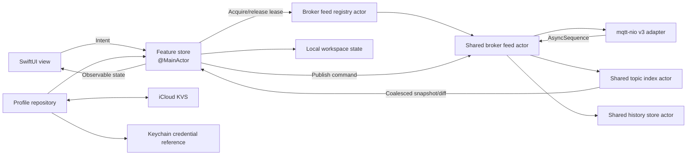

# JollysMQTT Implementation Plan

## 1. Product outcome

Build a native MQTT exploration and debugging client with these defining
behaviors:

1. It runs from one shared SwiftUI codebase on iPhone, iPad, and Mac.
2. A window starts as a broker list. Connecting replaces that window's content
   with a live broker workspace.
3. macOS `Command-N` opens another broker-list window. iPadOS supports the
   equivalent multi-scene workflow. Each window has independent presentation
   state; windows viewing the same effective profile normally share one broker
   feed.
4. Connected workspaces present topics as a live hierarchy, modeled after the
   useful interaction concepts of MQTT Explorer without copying its assets.
5. A selected topic can be inspected as text, formatted JSON, or bytes; copied;
   compared with its previous values; published with QoS and retain options;
   and plotted when it contains numeric data.
6. Reopening the app restores the windows that were open and each window's
   selected broker, topic, outline expansion, inspector state, and graph
   configuration. A restored connection reconnects; it is not expected to have
   remained alive while the app was terminated.
7. Broker definitions synchronize through iCloud. Passwords stay in Keychain.

Reference behavior:

- MQTT Explorer feature overview:
  <https://mqtt-explorer.com/>
- mqtt-nio:
  <https://github.com/swift-server-community/mqtt-nio>
- Existing local mqtt-nio v3 migration and MQTT Explorer screenshot:
  `~/GitHub/modbus2mqtt`
- Checked-in MQTT Explorer behavioral reference at revision
  `52c576a141d91de47a651f50b118b518f2490bcf`:
  `Documentation/MQTT-Explorer`
- Detailed reference review:
  [MQTT_EXPLORER_FINDINGS.md](MQTT_EXPLORER_FINDINGS.md)
- SwiftUI state restoration:
  <https://developer.apple.com/documentation/swiftui/restoring-your-app-s-state-with-swiftui>

## 2. Explicit assumptions

- Initial deployment targets are iOS/iPadOS 18 and macOS 15, matching
  mqtt-nio 3's declared minimums. Raising these later is easy; lowering them
  would require replacing current observation and window APIs.
- The package and app compile in Swift 6 mode with complete concurrency checks.
- "mqttnio version 3" means the mqtt-nio package's v3 API, not merely MQTT
  protocol 3.1.1.
- The local `modbus2mqtt` checkout has resolved mqtt-nio
  `3.0.0-alpha.2` at revision
  `c980b0f86a3d211f04391a0f5ea627b0960751d3`. Pin that tag exactly until a
  newer version passes JollysMQTT's compatibility suite.
- MQTT 3.1.1 is the initial protocol default. The domain model leaves room for
  MQTT 5 because mqtt-nio supports both.
- iPhone uses one active app scene. Multiwindow is a first-class requirement on
  macOS and iPadOS.
- iOS background execution cannot promise a continuously connected general
  MQTT client. When a scene becomes inactive, the app saves state and either
  disconnects or allows the OS to suspend it; it reconnects on activation.
- Broker profiles sync, but window layout, open windows, topic history, and
  graph samples are device-local.
- Passwords do not sync in v1. When a profile arrives through iCloud on another
  device, the user supplies credentials there once.

## 3. Scope

### 3.1 Version 1

- Create, edit, duplicate, delete, and reorder broker profiles.
- TCP and TLS broker connections using mqtt-nio 3.
- Username/password authentication.
- MQTT 3.1.1, clean-session configuration, keepalive, client-ID policy, and
  configurable subscription filters.
- Automatic reconnect with visible state, bounded exponential backoff, jitter,
  and an explicit cancel path.
- Live hierarchical topic outline with topic/current-value search, activity
  indicators, descendant counts, sort modes, and Freeze View.
- Current payload metadata: receive time, QoS, retained flag, byte count, and
  direction.
- Text, formatted JSON, and hex payload presentations.
- Copy topic, raw payload, display text, formatted JSON, and JSON value.
- Paste into a publish composer.
- Publish with QoS 0/1/2 and retain on/off.
- Bounded, deduplicated successful-publish history that can restore a draft.
- Delete a retained value by publishing a zero-byte retained payload after
  confirmation.
- Recursively delete locally known value-bearing topics with exact-count
  confirmation and partial-failure reporting.
- Bounded local per-topic history and current-versus-previous diff.
- Numeric graphs for scalar payloads and selected JSON numeric paths.
- macOS/iPadOS multiwindow and scene restoration.
- iCloud broker-profile synchronization.
- Device-local Keychain credentials.
- Light/dark mode, Dynamic Type, keyboard navigation, VoiceOver labels, and
  reduced-motion support.

### 3.2 Deliberately deferred

- MQTT 5-specific properties and reason-code UI.
- WebSocket transport.
- Client-certificate identity import and management.
- Bonjour broker discovery.
- iCloud-synchronized credentials.
- iCloud-synchronized history or graph samples.
- Payload schemas, CBOR/MessagePack/Protobuf plug-ins.
- Broker administration features not defined by MQTT itself, such as ACL,
  retained-message inventories, or connected-client lists.
- Background monitoring and notifications on iOS.
- Export/import of workspace bundles and histories.

The model should not block these features, but none should delay a coherent v1.

## 4. Architecture decision

### 4.1 Pattern

Use feature-scoped MVI for user workflows and actor-owned streaming services for
high-frequency MQTT data.

This is a fit because connection and restoration behavior are explicit state
machines, effects need deterministic cancellation, and user actions must be
testable without a broker. A single global reducer is not appropriate: feeding
every MQTT publication through one app-wide value state would create excessive
copying and invalidation. Instead:

- `ServerListFeature`, `WorkspaceFeature`, `ConnectionFeature`,
  `TopicDetailFeature`, `PublishFeature`, and `GraphFeature` each own small
  state, intents, actions, and effects.
- A registry pools a connection actor, topic index, and history writer by
  effective broker configuration and leases that feed to workspaces.
- A broker-feed actor receives the mqtt-nio stream.
- A topic-index actor mutates the high-volume trie and emits coalesced,
  presentation-ready changes.
- A history actor batches durable writes.
- Main-actor observable feature stores consume those bounded/coalesced streams.



### 4.2 Isolation boundaries

- `@MainActor`: observable UI stores, focus/selection state, app commands, and
  scene coordination.
- `BrokerFeedRegistry` actor: reference-counted feeds keyed by an immutable
  effective connection descriptor. It prevents duplicate wildcard
  subscriptions and client-ID collisions when two windows open one profile.
- `BrokerFeed` actor: connection lifecycle, subscribe lifetime, publish
  commands, reconnect policy, session metrics, and fan-out to attached
  workspaces.
- `TopicIndex` actor: exact MQTT topic trie, latest values, counts, rates, and
  outline snapshots.
- `HistoryRepository` actor: database connection, batching, retention, and
  queries.
- `ProfileRepository` actor: atomic local profile file and iCloud merge.
- Keychain access: a small sendable service called from storage actors, never
  directly from a view.

No `@unchecked Sendable`, `@preconcurrency`, or unsafe isolation escape hatch is
planned. If mqtt-nio forces one, document the safety invariant and isolate it
inside `JollysMQTTTransport`.

## 5. Repository and target layout

```text
JollysMQTT/
├── AGENTS.md
├── README.md
├── AI/
│   ├── IMPLEMENTATION_PLAN.md
│   ├── MODBUS2MQTT_FINDINGS.md
│   └── ADR/
├── JollysMQTT.xcodeproj/
├── JollysMQTTApp/
│   ├── JollysMQTTApp.swift
│   ├── JollysMQTT.entitlements
│   ├── Info.plist
│   └── Assets.xcassets/
└── JollysMQTTPackage/
    ├── Package.swift
    ├── Sources/
    │   ├── CSQLite/
    │   ├── JollysMQTTCore/
    │   ├── JollysMQTTTransport/
    │   ├── JollysMQTTStorage/
    │   └── JollysMQTT/
    └── Tests/
        ├── JollysMQTTCoreTests/
        ├── JollysMQTTTransportTests/
        ├── JollysMQTTStorageTests/
        └── JollysMQTTTests/
```

### `JollysMQTTCore`

- `BrokerProfile`, `SubscriptionDefinition`, `WorkspaceID`
- transport-neutral connection/publish/message values
- `MQTTTransporting` protocol
- exact topic parsing and trie/index
- payload classification and JSON/numeric extraction
- feature states, intents, actions, reducers, and effect descriptors
- reconnect and retention policies

It does not import SwiftUI, AppKit, UIKit, Security, iCloud APIs, MQTTNIO, or
NIO.

### `JollysMQTTTransport`

- mqtt-nio 3 connection adapter
- NIO `ByteBuffer` to `Data` conversion
- TCP/TLS and Network.framework bootstrap selection
- MQTT 3.1.1 configuration mapping
- cancellation and error mapping
- no UI, persistence, or Keychain code

This is the only target that depends on:

```swift
.package(
    url: "https://github.com/swift-server-community/mqtt-nio.git",
    exact: "3.0.0-alpha.2"
)
```

Before feature work, build a narrow compatibility spike that proves on both
macOS and iOS:

1. connect and orderly disconnect,
2. subscribe to `#` and consume its `AsyncSequence`,
3. publish while a subscription is active,
4. cancel subscription and connection tasks,
5. explicitly use `NIOTSEventLoopGroup.singleton.any()` on iOS and macOS,
6. TLS through `TSTLSConfiguration` with system trust, and
7. reconnect a stored `MQTTSession` where appropriate.

The default scoped pattern is already demonstrated by `modbus2mqtt`:

```text
outer reconnect loop
  → MQTTConnection.withConnection
    → connection.subscribe
      → throwing task group
        → subscription consumer
        → publish-command consumer
        → connection/session monitor
```

When the subscription throws, the task group cancels its siblings, unwinding
the subscription and connection scopes before the reconnect loop tries again.
The spike determines whether persistent-session mode should instead use a
longer-lived mqtt-nio `MQTTSession` plus session-level subscription. mqtt-nio
allows only one concurrent connection to borrow a given `MQTTSession`; the
registry must enforce that invariant.

### `JollysMQTTStorage`

- versioned local broker-profile document
- per-record iCloud merge and tombstones
- Keychain credential storage
- versioned local workspace records
- local message-history database
- schema migrations and retention pruning

### `JollysMQTT`

- public `JollysMQTTRootView`
- feature stores and dependency composition
- broker list/editor
- adaptive connected workspace
- topic outline abstraction and platform implementations
- payload/history/diff/publish/graph views
- focused actions and app commands
- package String Catalog and other UI resources

### Thin app target

The app target owns only:

- `@main` and `WindowGroup`,
- iCloud, Keychain, app sandbox, and outgoing-network entitlements,
- app identity, icons, and launch metadata,
- the local Swift package reference.

It imports `JollysMQTT` and presents the package root. No broker model, mqtt-nio
call, or history query belongs there.

## 6. Domain model

### 6.1 Broker profile

`BrokerProfile` is a `Codable`, `Identifiable`, `Hashable`, `Sendable` value:

- immutable `UUID` identity
- display name
- hostname and port
- transport: TCP or TLS
- MQTT protocol version
- username, with password represented only by a Keychain credential reference
- client ID policy
- clean-session setting
- keepalive interval
- reconnect policy
- one or more subscription filters with requested QoS and enabled state
- optional last-will configuration, excluding its secret payload if sensitive
- created/modified timestamps, revision tie-breaker, and deletion tombstone

Default subscriptions are `#` and `$SYS/#` at QoS 0. The explicit system
filter is necessary because a root wildcard does not match a first topic level
beginning with `$`. The editor warns that broad filters can be expensive on
large production brokers. Users can disable or replace either filter with
narrower filters before connecting.

### 6.2 Client IDs, feed pooling, and multiple windows

Pool feeds by a `BrokerConnectionKey` derived from connection-affecting profile
fields and a non-secret credential revision. Never put a password in the key.
Display-name-only edits do not create a second feed; endpoint, authentication,
session, TLS, keepalive, or subscription changes do.

- Two windows opening the same effective profile acquire leases on the same
  feed and therefore use one MQTT client ID and one subscription set.
- Closing or disconnecting one window releases only its lease. The feed closes
  after the last lease is released, with a short grace period to avoid churn
  during scene transitions.
- Different profiles remain distinct feeds even if they point at the same host.
- Default client ID: stable installation-and-profile-derived identifier.
- Explicit fixed client ID: warn when another distinct feed already uses it.
- An advanced independent-connection action can be added later using an
  additional instance suffix; it is not the default.
- Clean session on maps to mqtt-nio's identifier-based `withConnection`.
- Clean session off maps to one mqtt-nio `MQTTSession` owned by the feed.
  In-memory reconnect continuity is supported, but persistence of mqtt-nio's
  client-side inflight state across app termination is not currently public.
  Do not promise full QoS 2 session restoration across launches until the
  compatibility spike proves it.

### 6.3 Workspace state

Each scene gets an immutable `WorkspaceID`. Its local record contains:

- mode: broker list or connected profile ID
- reconnect-on-restore preference
- selected topic
- outline expansion paths
- topic search/filter
- active detail section
- publish draft, excluding secret material
- history selection
- graph configurations
- visible time range, auto-scroll, interpolation, and Y-axis mode
- compact destination: topics, details, publish, or charts
- Freeze View state and last acknowledged topic snapshot revision
- split-view/inspector visibility where portable

Window frame and placement remain system-managed. The data record restores
content; SwiftUI/AppKit restores geometry.

### 6.4 Topic identity and tree

MQTT topic parsing must preserve protocol edge cases:

- leading, trailing, and repeated `/` create empty levels and are not collapsed,
- a topic can contain a value and also have children,
- topic names are case-sensitive,
- wildcard characters are valid in filters but not publication topic names.

A node's durable identity is `(brokerProfileID, exactFullTopic)`. Synthetic
branch nodes use their exact prefix. Display order uses localized standard
comparison only for presentation; protocol identity is never localized.

Each node tracks:

- latest message reference
- whether it currently has a retained value
- children
- total message count
- descendant value-topic and message counts
- last receive timestamp
- rolling rate/activity bucket
- detected payload presentation

Sibling presentation order is workspace state: alphabetical, newest activity,
descending descendant message count, or descending descendant topic count.
Filtering matches the case-folded exact topic path or latest decoded payload
summary and returns ancestor paths required to locate each match.

## 7. MQTT transport and lifecycle

Connection state is explicit:

```text
idle → resolving → connecting → subscribing → connected
  ↑                                      ↓
  └──── waitingToReconnect ← failed/disconnected
```

User disconnect and window close detach that workspace and suppress reconnect
for that lease. The shared feed goes to `idle` only after its last lease is
released or the user explicitly disconnects the feed for every attached
window.

Implementation requirements:

- Use mqtt-nio v3's structured connection/subscription scopes.
- Mirror the proven `modbus2mqtt` supervision rule: one thrown MQTT worker error
  cancels sibling workers, unwinds the scoped connection, and only then allows
  the outer reconnect loop to continue.
- One parent feed task owns all child subscription, command,
  connection-monitor, and event-processing work.
- Explicitly close the active `MQTTConnection` when feed cancellation occurs;
  do not assume an arbitrary wait on the NIO close future is
  cancellation-aware.
- Cancellation propagates from the last feed lease to subscriptions, batching,
  and connection cleanup.
- Convert `ByteBuffer` to owned `Data` at the transport boundary before values
  enter core, history, or UI modules.
- Pass a per-feed `swift-log` logger to mqtt-nio with broker/profile metadata,
  while redacting credentials and payloads.
- Expected errors become typed actions such as authentication rejected, TLS
  trust failed, network unavailable, broker unavailable, protocol error, and
  subscription rejected.
- Reconnect uses exponential backoff with jitter and a maximum delay. Network
  path recovery can trigger an earlier retry.
- The UI always shows state, last failure, next retry time, and a Retry/Cancel
  action.
- Receive timestamps are local arrival times; MQTT 3.1.1 does not provide a
  broker event timestamp.
- Apply a configurable maximum payload size before copying into history/UI.
- Never decode arbitrary bytes as UTF-8 without validation.

The mqtt-nio default connection event loop is POSIX. JollysMQTT must pass
`NIOTSEventLoopGroup.singleton.any()` explicitly on Apple platforms; iOS should
always use Network.framework. TLS defaults to
`TSTLSConfiguration(certificateVerification: .fullVerification)` with system
trust. Custom CA and client identity support is deferred until the basic Apple
transport path is proven on device.

## 8. Streaming and performance design

A broker can produce messages much faster than a SwiftUI outline should redraw.
The transport path and presentation path therefore have different guarantees:

- The broker-feed actor processes every message accepted under configured
  limits.
- History persistence is bounded and batched.
- The topic index always keeps the latest value and correct counters.
- UI activity updates are coalesced, initially to at most 10 updates per second.
- Multiple messages for the same topic in one UI interval collapse into one
  latest-node update, without losing retained history entries within limits.
- Outline filtering and sorting are prepared outside `body`.
- Rows receive narrow immutable snapshots with stable IDs.
- Freeze View holds a workspace's displayed snapshot while the feed, counters,
  bounded history, and persistence continue. It exposes a bounded pending
  change count. Jump to Live replaces the frozen snapshot with the newest
  coalesced snapshot instead of animating every intermediate mutation.

Initial performance targets:

- 10,000 visible/discovered topics without interaction stalls.
- 100,000 small messages per minute in a synthetic test while maintaining
  responsive search, selection, and scrolling.
- No unbounded `AsyncStream`, array, task, or payload cache.
- Releasing the last workspace lease releases the feed and large topic tree.

If a pure SwiftUI `OutlineGroup` cannot meet the macOS target, use an
`NSOutlineView` representable with incremental row reloads and preserved
expansion. iOS/iPadOS use an adaptive SwiftUI list/navigation presentation.

## 9. User interface

### 9.1 Broker-list workspace

New windows show:

- searchable list of saved brokers
- broker name with a secondary endpoint summary
- connection status only for this window's attempted connection
- Add, Edit, Duplicate, Delete, and Connect actions
- validation in the editor before Save/Connect
- advanced disclosure for client ID, clean session, keepalive, subscriptions,
  reconnect, and TLS settings
- a visible indicator when a synced profile lacks a local password

On macOS:

- `Command-N`: new window at broker list
- `Command-O` or Return: connect selected broker in current window
- `Command-Shift-N`: add broker
- `Command-W`: close current window and release its feed lease

On iPhone, the profile editor uses `NavigationStack` and the connected
workspace uses the compact destinations defined below. On iPad and Mac, use
`NavigationSplitView` where it maps cleanly to the content.

### 9.2 Connected workspace

Wide layout:

```text
┌──────────────────────┬───────────────────────────────────────────┐
│ Topic outline        │ Selected topic                            │
│ search + activity    │ metadata / value / history / publish      │
│ branch counts/value  │ optional inspector                        │
├──────────────────────┴───────────────────────────────────────────┤
│ Pinned graph dashboard: resizable cards in an adaptive grid      │
└──────────────────────────────────────────────────────────────────┘
```

Compact layout gives each major workflow a full-width destination. No feature
should require a pointer, hover, or secondary click.

On iPhone, expose four native compact destinations in a `TabView` or equivalent
accessible navigation model:

1. Topics
2. Details
3. Publish
4. Charts

Keep each destination's state alive while switching. Selecting a value-bearing
topic can advance to Details, and returning to Topics scrolls to the selected
row. iPad uses `NavigationSplitView` where space allows while retaining
first-class access to Publish and Charts.

Topic outline row:

- segment name
- descendant topic and message counts on branch rows
- retained indicator
- recent-activity pulse that respects Reduce Motion
- optional compact current scalar or JSON summary after `=`
- child disclosure
- stable selection and expansion during updates

Outline controls include:

- search over full topic paths and latest decoded payload summaries
- sort by name, recent activity, descendant messages, or descendant topics
- Freeze View / Jump to Live with pending-change count
- keyboard traversal matching native outline conventions

Context actions:

- copy full topic
- open publisher for this topic
- plot numeric value
- delete retained value
- clear local history

### 9.3 Payload inspector

Automatic presentation order:

1. valid JSON → formatted structural view and raw view,
2. valid UTF-8 → text,
3. otherwise → hex with byte count.

The JSON view:

- preserves numeric precision as far as Foundation parsing permits,
- supports expanding/collapsing containers,
- lets a numeric leaf create a graph using a JSON Pointer-like path,
- copies either the selected scalar, formatted subtree, or entire document.

The metadata header shows exact topic, local receive time, QoS, retained flag,
direction, and payload size.

The retained flag is labeled as metadata on the received publish. Help text
must not imply that a live publish with `retain == false` proves the broker has
no retained value; brokers set the flag according to retained-delivery
semantics.

### 9.4 Publish composer

Fields:

- topic
- payload editor
- text/JSON/hex input mode
- JSON validation/format action
- QoS 0/1/2
- retain toggle
- Publish button and `Command-Return` on macOS

Selecting a topic pre-fills the composer unless the user has manually edited
the draft topic. Standard Copy, Paste, Paste and Match Style, Select All, and
Undo operate on the focused topic or payload editor. A bounded, deduplicated
history of successful publishes can repopulate topic, payload, mode, QoS, and
retain settings. Failed publishes never enter that history.

Publishing a zero-byte retained payload is labeled "Delete retained value" and
requires confirmation. A normal zero-byte non-retained publish remains
available.

Recursive retained deletion is a separate destructive action. It enumerates
only locally known value-bearing topics in the selected subtree, confirms the
exact count, publishes zero-byte retained values, advances local state only
after each successful publish, and reports partial failures with retryable
topics. It is labeled as an attempt to clear broker-retained state, not as a
complete retained-message inventory operation.

### 9.5 History and diff

- Keep newest-first bounded history per topic.
- Allow keyboard and pointer selection.
- With no explicit baseline, compare current with the immediately previous
  entry. Selecting a history row compares current with that entry; selecting it
  again clears the override.
- Show receive time, elapsed time from the newer message, and compact
  QoS/retain/direction metadata, with a row-level copy action.
- JSON values receive structural diff; text receives line diff; bytes receive a
  hex-level summary rather than pretending to be text.
- Published outgoing values appear in local history with direction metadata,
  then can be reconciled with broker echo if subscribed.

Default retention proposed for the first implementation:

- up to 1,000 entries per topic,
- up to 250 MB per broker database,
- payloads over 1 MB represented by metadata unless the user opts into a
  higher limit.

These values must be configurable and enforced in the storage actor.

### 9.6 Graphs

Use Swift Charts.

A graph series is:

- broker/profile ID
- exact topic
- scalar root or JSON numeric path
- display name and style
- conversion rule: number, boolean-as-0/1, or optional unit scaling

Graph state includes time range, auto-scroll, line/point mode, Y-axis
automatic/fixed bounds, downsampling policy, color, adaptive grid span, card
order, paused state, and sample-clear marker. Persist the configuration in the
workspace record. Rebuild samples from local history on restoration, then
append live points.

The concrete MQTT Explorer screenshot in
`~/GitHub/modbus2mqtt/Images/mqtt-explorer.png` shows a useful dashboard
interaction to preserve:

- clicking a numeric value pins a graph without replacing the topic outline,
- multiple graphs appear simultaneously in a card grid,
- each card has Pause/Resume, Settings, and Remove controls,
- settings include Y-axis range, time range, line/point/step presentation,
  color, adaptive size, clear displayed samples, and reorder,
- graph order, size, paused state, and settings restore with the workspace.

Clearing graph samples does not clear durable topic history. Pausing one card
freezes that card's display while broker ingestion and other graphs continue.

On compact devices, show the pinned graphs as a list or one focused chart
instead of forcing a desktop grid.

Use a bounded downsampling algorithm for display; never pass every historical
sample to Charts when the pixel width cannot show it. A graph is an inspection
tool, not an authoritative telemetry database.

## 10. Windowing and restoration

Declare a typed data-presenting `WindowGroup` keyed by `WorkspaceID`. SwiftUI
persists that lightweight identity for state restoration.

Expected scene flow:

1. `Command-N` calls `openWindow(value: WorkspaceID())`.
2. The default workspace record is `.serverList`.
3. Connect updates the record to `.connected(profileID)` and renders the
   connected workspace in the same scene.
4. Each window creates its own feature store and acquires a lease from the
   broker-feed registry. The same effective profile reuses an existing feed.
5. Scene state changes are debounced and written atomically.
6. Closing the scene marks that workspace closed, releases its feed lease, and
   retains workspace state only for a short recovery period. The last feed
   lease triggers connection cancellation and cleanup.
7. At app relaunch, SwiftUI restores open `WorkspaceID` values; the package
   loads each corresponding state and reconnects when configured.

Use `@SceneStorage` only for small plist-compatible routing values. Store the
versioned workspace payload in local application support keyed by
`WorkspaceID`; scene storage is not the application's data model and provides
no persistence timing guarantee.

Restoration tests must cover normal quit/relaunch. Force-quitting from the app
switcher can intentionally discard system-preserved scene state during
development and is not the only valid test procedure.

## 11. Storage and iCloud

### 11.1 Broker profiles

Follow the proven small-settings pattern from JollysFastVNCSwiftUI:

- atomic versioned local JSON document
- encoded cloud envelope in `NSUbiquitousKeyValueStore`
- merge per profile by modification metadata
- deterministic tie-breaker for equal timestamps
- tombstones for deletion
- observer for external and initial sync changes
- validation and a last-known-good local backup

Do not use one whole-document last-writer-wins timestamp; concurrent edits to
different profiles must merge.

iCloud KVS is appropriate because broker profiles are small settings records.
If the encoded profile set approaches its quota, show a diagnostic and stop
adding optional data rather than silently losing settings.

### 11.2 Credentials

- Generic-password Keychain item keyed by broker UUID and credential kind.
- Appropriate accessible-after-first-unlock/device policy.
- Never serialize the password into the profile.
- Deleting a profile offers to delete its local credential.
- Synced profiles can exist without credentials.
- Certificate file bookmarks, if later added, remain local capabilities.

### 11.3 History

The baseline plan is a small package-owned SQLite layer over the system SQLite
library:

- one database per broker profile to make pruning/deletion cheap,
- WAL mode,
- prepared batched inserts,
- indexed by `(topic, receivedAt)`,
- schema version table and explicit migrations,
- storage actor is the only database owner,
- retention runs incrementally and on idle/close,
- payload data stored as bytes without lossy conversion.

Start Milestone 4 with a short technical spike comparing direct SQLite
throughput against a local-only SwiftData model. Keep direct SQLite unless
SwiftData meets the synthetic message-rate, bounded-pruning, and migration
tests with materially less code. Record any reversal in an ADR. The public
`HistoryRepository` protocol keeps this decision replaceable.

## 12. Error, security, and privacy behavior

- Redact passwords, authorization material, and payloads from normal logs.
- Consider broker endpoints, usernames, topics, and retained payloads private.
- Add `NSLocalNetworkUsageDescription` because local brokers are a primary use
  case.
- Use the app sandbox with outgoing network access on macOS.
- Treat entitlement changes as security-sensitive.
- Do not weaken TLS trust silently. An untrusted certificate produces a clear
  failure; a later explicit trust flow must show fingerprint and scope.
- Validate publish topic names and filter syntax before sending.
- Confirm recursive/destructive retained-message operations.
- Show whether an error came from DNS, TCP, TLS, MQTT CONNACK, SUBACK, or local
  storage in user-readable terms while retaining structured diagnostics.
- Provide a Clear History action per topic and per broker.
- Deleting a broker offers separate choices for local history and credential
  removal.

## 13. Testing strategy

### 13.1 Core unit tests

- topic splitting with leading/trailing/repeated separators
- topic-as-value-and-parent behavior
- stable identity and deterministic display ordering
- `#` and `$SYS/#` default-filter behavior
- incremental insert/update/remove snapshots
- topic-path and current-payload search with preserved ancestor paths
- outline sorting by name, activity, descendant messages, and descendant topics
- payload classification: JSON, UTF-8, invalid UTF-8, empty, oversized
- numeric extraction including nested arrays/objects and invalid paths
- reconnect backoff and jitter bounds using an injected clock/random source
- reducers for every connection state and expected failure
- history retention/downsampling

### 13.2 Storage tests

- profile document round trip and migration
- per-record cloud merge
- concurrent unrelated edits
- deterministic equal-time conflict resolution
- tombstone deletion and expiry
- corrupted cloud/local payload fallback
- no credential in serialized documents
- Keychain adapter contract through a fake
- workspace state version migration
- SQLite batch insert, query ordering, pruning, and crash recovery

### 13.3 Transport tests

Unit-test feature code with `FakeMQTTTransport`, whose streams and clock are
fully controlled.

Run mqtt-nio integration tests against an isolated Mosquitto instance:

- MQTT 3.1.1 connect/disconnect
- subscribe and receive
- publish QoS 0/1/2
- retained delivery and retained deletion
- authentication accepted/rejected
- custom filters
- cancellation during connect and active subscription
- reconnect after broker restart
- TLS success and trust failure
- clean-session and in-process persistent-session paths
- two workspaces connected to the same profile share one feed and one client ID
- two distinct profiles using the same explicit client ID produce a warning or
  controlled broker-takeover error
- Apple tests use the Transport Services event loop rather than the default
  POSIX event loop

No integration test uses a real personal broker.

### 13.4 UI and restoration tests

- new window starts at broker list
- connecting transforms only current window
- `Command-N` creates an independent workspace
- same profile can appear in two windows with shared feed data but independent
  selection, expansion, publish draft, and graph dashboard
- closing one of two attached windows does not close the shared feed
- closing the last attached window cancels the feed connection
- selected topic and graph configuration restore
- broker profile received from iCloud shows missing-credential state
- compact Topics/Details/Publish/Charts navigation and regular-width split
  navigation
- keyboard copy/paste/publish
- Freeze View continues ingestion and Jump to Live obtains the latest snapshot
- default previous-message diff and selected-history baseline toggle
- failed publishes do not enter draft history
- recursive retained deletion reports partial success without clearing failed
  topics locally
- chart-card pause, range, style, color, size, reorder, clear, and removal
- VoiceOver labels and Dynamic Type

### 13.5 Performance tests

Generate deterministic topic/message streams and record:

- ingest throughput
- main-thread time
- topic-tree snapshot cost
- outline update cost
- history write throughput
- peak memory and release after closing a workspace
- chart query/downsampling cost

Performance regressions should be test failures or recorded benchmark deltas,
not subjective manual impressions.

## 14. Delivery sequence

Each milestone is a vertical slice that leaves the project buildable and tested.

### Milestone 0 — scaffold and dependency proof

- Create thin multiplatform Xcode app and local package.
- Establish Swift 6.2.3 settings and deployment targets.
- Add exact mqtt-nio `3.0.0-alpha.2` pin only to transport target.
- Add package/app build schemes and test plan.
- Prove connect, subscribe, publish, cancellation, and TLS on macOS and iOS.
- Record whether mqtt-nio `MQTTSession` is used in an ADR.

Exit: both app destinations build and the transport spike passes against
Mosquitto.

### Milestone 1 — profiles, credentials, and window skeleton

- Implement domain profile model and validation.
- Implement local profile repository and Keychain.
- Build broker list/editor.
- Add typed `WindowGroup`, `WorkspaceID`, and `Command-N`.
- Connect action transforms current scene into a placeholder workspace.
- Add initial state restoration tests.

Exit: profiles can be managed, two windows have independent presentation state,
and secrets never enter serialized profile data.

### Milestone 2 — live connection and topic outline

- Implement broker-feed actor and reconnect state machine.
- Implement the reference-counted broker-feed registry.
- Implement subscription filters with default `#` and `$SYS/#`, and test
  system-topic visibility.
- Build topic trie/index and coalesced UI change stream.
- Build macOS and compact outline presentations, search/sort, and Freeze View.
- Show connection state and typed errors.

Exit: a real broker's topic hierarchy is usable in two concurrent windows;
same-profile windows share one feed, and closing the last lease cleans it up.

### Milestone 3 — inspect, copy, and publish

- Add metadata and text/JSON/hex payload views.
- Add copy commands and platform pasteboard adapters.
- Add publish composer with QoS and retain.
- Add successful-publish draft history.
- Add retained deletion confirmation.
- Add recursive retained deletion with exact-count confirmation and
  partial-failure reporting.
- Add keyboard/focused commands and accessibility pass.

Exit: common MQTT inspection and editing tasks work without leaving the topic
workspace.

### Milestone 4 — durable history, diff, and graphs

- Complete history storage spike and choose SQLite or SwiftData behind the
  repository protocol.
- Add retention settings and pruning.
- Add history browser and diffs.
- Add Swift Charts and JSON numeric-path selection.
- Add the persistent multi-card graph dashboard inspired by the checked-in MQTT
  Explorer reference image.
- Add per-card pause, axis/time ranges, style, color, size, clear, reorder, and
  remove controls.
- Persist complete graph configuration in workspace state.

Exit: history is bounded, graph state restores, and charts remain responsive
under benchmark load.

### Milestone 5 — iCloud profile synchronization

- Add iCloud KVS envelope, per-record merge, and tombstones.
- Add external-change handling and conflict tests.
- Add missing-local-credential UI.
- Test with two physical/simulated account devices where practical.

Exit: profile edits and deletions converge without syncing credentials or
history.

### Milestone 6 — hardening and release readiness

- Run performance suite at target scale and tune coalescing.
- Complete TLS/device tests and network transition tests.
- Complete localization String Catalog.
- Complete accessibility and reduced-motion audit.
- Add privacy strings, entitlements, app icon, help, and onboarding.
- Validate state restoration after normal quit, termination, crash recovery,
  display changes, and app update.
- Archive signed iOS and macOS builds only when release work is explicitly
  requested.

Exit: all automated tests pass, package and both app platforms build without
concurrency warnings, and release/privacy documentation is complete.

## 15. Architecture review checklist

Before merging each feature:

- Is state owned by exactly one feature store or actor?
- Does a view render state and send intents without performing infrastructure
  work?
- Are reducer transitions deterministic and broker-free under test?
- Does every effect return a modeled success/failure action?
- Is cancellation handled for connection, subscription, reconnect, history,
  and coalescing work?
- Are high-frequency updates bounded before reaching the main actor?
- Are outline IDs stable and independent of ordering or mutable payloads?
- Does the change avoid placing NIO types outside the transport target?
- Are profile schema changes versioned and backward-compatible?
- Are secrets and payloads absent from logs and synchronized settings?
- Does a second window get independent presentation state while reusing only a
  connection-compatible shared feed?
- Does the feature restore from a versioned workspace state?
- Are compact iPhone and wide iPad/Mac layouts both functional?
- Are user-facing strings localizable from the package bundle?
- Was checked-in MQTT Explorer material used only as behavioral research, with
  no copied source, assets, prose, or styles?
- Do build, unit, integration, restoration, and relevant performance tests pass?

## 16. Early risks and decisions to revisit

| Risk | Mitigation / decision gate |
|------|----------------------------|
| mqtt-nio 3 API churn | Exact prerelease pin and single adapter target; upgrade only behind integration suite |
| mqtt-nio 3 toolchain requirement | Establish Swift 6.2.3 in Milestone 0 before UI work |
| Very large wildcard subscriptions | Configurable filters, payload limits, actor aggregation, UI coalescing, bounded history |
| SwiftUI outline performance | Stable narrow row snapshots; macOS `NSOutlineView` adapter fallback |
| Window restoration differences by OS/user settings | Typed `WindowGroup` identity plus versioned local workspace state and platform UI tests |
| Duplicate MQTT traffic/client IDs across windows | Reference-counted feed pooling by effective profile; warnings for conflicting explicit IDs |
| iCloud conflict/resurrection | Per-record merge, deterministic tie-breaker, tombstones, corruption fallback |
| MQTT Explorer license metadata conflicts with its license text | Treat it as behavioral research only; copy no code/assets/text/styles without separate review |
| Freeze View falls far behind a busy broker | Continue bounded ingest but retain only the latest presentation revision and bounded pending count; Jump to Live replaces the snapshot |
| History database growth | Per-topic and per-broker bounds, incremental pruning, oversized-payload policy |
| iOS suspension | Explicitly promise reconnect/restoration, not continuous background MQTT |
| Graph overload | Query only requested series, pause cards independently, and downsample to visible resolution |

No later feature work should begin until Milestone 0 answers the mqtt-nio
structured-lifetime and Apple TLS questions; those answers affect the connection
actor's public contract.
